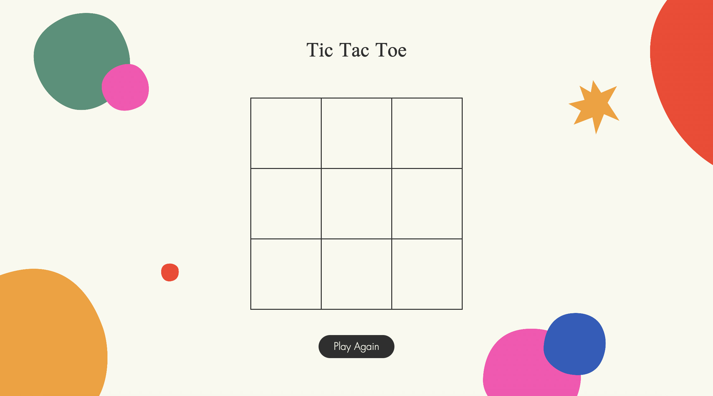
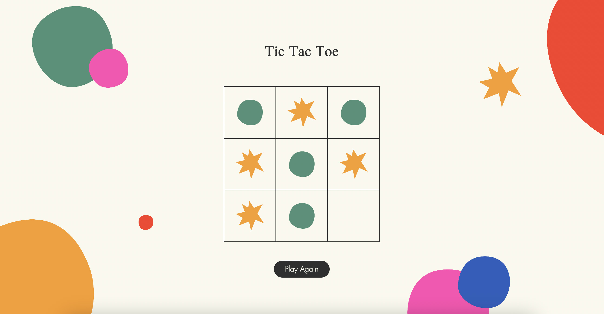
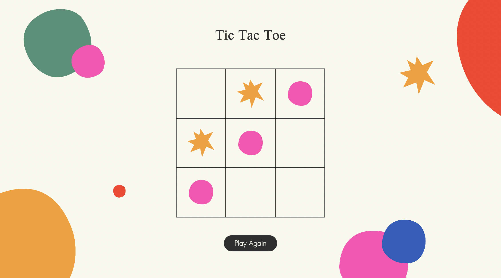

# Tic Tac Toe

A browser-based Tic Tac Toe game built with HTML, CSS, and JavaScript. The graphics were created by me using Adobe Illustrator.

Tic Tac Toe is part of the Developer Akademie's training programme for software developers ([www.developerakademie.com](https://www.developerakademie.com)). The goal of the project was to use AI tools (GPT and GitHub Copilot) to build the code based on precise step-by-step instructions, with custom adjustments and design decisions made independently.







## Table of Contents

- [Prerequisites](#prerequisites)
- [Quickstart](#quickstart)
- [Project Structure](#project-structure)

## Prerequisites

No build tool or server required — just a modern browser.

## Quickstart

Clone the repository:

```bash
git clone https://github.com/karinaklages/tic-tac-toe.git
cd tic-tac-toe
```

Then open `index.html` directly in your browser:

```text
tic-tac-toe/index.html
```

## Project Structure

```text
tic-tac-toe/
├── assets/
│   ├── fonts/       # Local font files
│   ├── icons/       # Game icons
│   └── img/         # Images and screenshots
├── styles.css/
│   ├── fonts.css    # Font definitions
│   └── mobile.css   # Responsive styles for mobile devices
├── .gitignore
├── index.html       # Application entry point
├── script.js        # Core game logic
└── style.css        # Main stylesheet
```